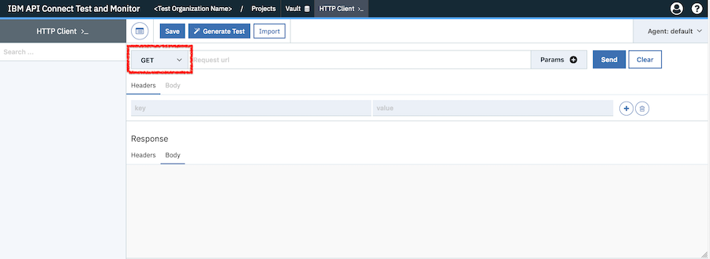

Creating an API test involves the following three steps:
1. Creating a request.
1. Sending the request to an API endpoint.
1. Generating a test from the response that's returned from the endpoint.

The following instructions show you how to create a test by using the "HTTP Client".

### What is the HTTP client?

After you log in to IBM API Connect Test and Monitor, you land on the HTTP Client.

To reach the HTTP Client from any other page, click **HTTP Client** in the menu bar at the top of the page.

# Step 1: Creating a request 

The HTTP Client page contains the following three sections:
1. The top section is where you specify the request type, the URL, and any other parameters that are needed. It's also where the **Send** and **Clear** buttons are located.
1. The center section is where you define the request headers and body.
1. The bottom section is where the headers and body of the response appear after you've sent the request. You don't need to do anything in this section.

The following instructions use `GET https://us-east.apitest.apiconnect.ibmcloud.com/app/api/examples/retail/products` for illustration purposes, which is a built-in API endpoint example. This example requires no parameters to be added to the URL, and requires no request headers or body to be supplied. 

## Set the request type

In the top section of the HTTP Client, select the type of request that you want from the drop-down menu to the left of the **Request url** field. 

The following options are available:
- `GET`
- `POST`
- `PUT`
- `PATCH`
- `DELETE`

For our example, select `GET`.

## Set the API endpoint URL

In the top section, complete the **Request url** field with the API endpoint URL. For our example, enter: `https://us-east.apitest.apiconnect.ibmcloud.com/app/api/examples/retail/products`.

## Add parameters to the URL

If you are using a different API endpoint from our example, and it requires one or more parameters, click **Params +** next to the **Request url** field. A parameter line is added below the URL that you can edit.

Enter a parameter as a key-value pair.

To add more parameters, click the **add** icon  next to any defined parameter.

To remove a parameter, click the **delete** icon  next to the parameter.

## Configure the request headers

In the center section of the HTTP Client, select the **Headers** tab. If you're using our example, you don't need to supply any headers.

Define a header as key-value pair.

To add more headers, click the **add** icon  next to any defined header.

To remove a header, click the **delete** icon  next to the header.

## Configure the request body

In the center section of the HTTP Client, select the **Body** tab. This tab is not available if the request type is `GET`, so you don't need to complete this section if you're following our example.

Set the body type to either `URL Encoded` or `Raw`.

If you set the body type to `URL Encoded`, you must provide one or more key-value pairs.
- To add more key-value pairs to the body, click the **add** icon  next to any defined key-value pair.
- To remove a key-value pair, click the **delete** icon  next to the key-value pair.

If you set the body type to `Raw`, you must complete the following actions:
- Select the content type from the content type drop-down menu. The following options are available:
  - `application/x-www-form-urlencoded`
  - `application/json`
  - `text/xml`
  - `text/plain`
- Complete the request body in the text box under the body type selection.

# Step 2: Sending the request 

Click **Send** in the top section of the HTTP Client.

The response from the endpoint is displayed in the bottom section of the page. You can examine the returned headers and body by clicking the **Headers** and **Body** tabs in the response section.

# Step 3: Generating a test

Now that you've sent a request and received the response, you can generate the test.

Click **Generate Test** in the top section of the HTTP Client.

Enter a test name.

From the "Save to Project" drop-down menu, select a project name, or select **Create new project** to create your own project.

If you selected **Create new project**, enter a name for the project.

Click the **confirm** icon  to save the test and start the test generation.

After generation is complete, the "All set!" page is displayed. This page confirms the creation of your generated test.

Click **Close** to continue.

You are now in the test editor, called the Composer. In the Composer you can edit and run the test.

.

# What to do next

- Next topic: [Modifying a test](./modify-test)
