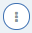

Use the Composer to update and modify your test. The following sections provide information about the Composer, and how to use it.  
  
[About the Composer](#about-the-composer)  
[Using the editor](#using-the-editor)   
[Adding a component](#adding-a-component)   
[Editing a component](#editing-a-component)   
[Moving components](#moving-components)   
[Transforming a component](#transforming-a-component)   
[Deleting a component](#deleting-a-component)   

# About the Composer

If you are not on the Composer page, or you want to modify a different test, follow the instructions in [Opening a test in the Composer](./open-test-in-composer) to find the test that you want to modify, and open it in the Composer.

The Composer shows all of the components that make up the test. In our getting started example, the first component is the request to the API endpoint - which in this case is a `GET` to `${endpointUrl}`. When the test was generated, it extracted the URL that you provided into a variable. To see any variables that were generated, click the **Data Sets** icon  in the left navigation pane.

After the request line, you will see the assertions and other components, for example `Aeq`, `Ai`, `Ae`, `for each in` and so on. For more information about assertion components, see [Assertion components](./dist/assertion-components).

# Using the editor

The test can be edited by using either the code (text) editor, or the visual (graphical) editor. Toggle between these two editors by clicking the **CODE** and **VISUAL** tabs in the upper right of the Composer. The visual editor is the default editor.

The following instructions describe how to make changes by using the visual editor.

# Adding a component

You can add a component by using one of the following options:

- By clicking the **add component** icon  in the upper left of the Composer.

- By clicking a component at the location where you want to add a new component, then clicking the **menu** icon , and selecting **Add component before** or **Add component after**, depending on where you want the new component to be positioned.

A list of component types is displayed.

After you've chosen your component type, carry out the following steps to add the component to your test. Note that you can hover over each component to see a description of what that component does.

1. Click the component type that you want to add. 

1. Configure the new component's parameters in the component dialogue box.

1. Click the **Confirm changes** icon  to apply the changes.

1. If your new component is in the wrong location, you can drag it to the correct location. Note that you can drag any component in your test.

1. Click **Save** to save your changes.

# Editing a component

You can edit a component in any one of the following ways:

1. Double-click the component to be edited.

1. Click the component, and then click the **Edit component** icon  in the upper left of the Composer.

1. Click the component, then click the **menu** icon  and select **Edit component**.

1. Click the component, then click **Edit** on the right of the component pane.

The edit dialogue box is displayed. Each component dialogue box will look different, as they all have different sets of parameters.

In the edit dialogue box, you can make the following changes:

- Modify any of the component's parameters.
- Clone the component by clicking the **Clone component** icon .
- Delete the component by clicking the **Remove component** icon .
- Cancel changes by clicking the **Cancel changes** icon .
- Apply changes by clicking the **Confirm changes** icon .

Click **Save** to save your changes.

# Moving components

Simply drag-and-drop any component from one position within the test to another position in the visual editor.

Remember to click **Save** to save your changes.

# Transforming a component

You can transform a request component to be a different type of request, and an assertion component to be a different type of assertion.

1. Click the request or assertion component to be transformed, then click the **Transform component** icon  in the upper left of the Composer.

1. Select the type of request or assertion that you require.

1. Complete the edit dialogue box for the new type of component.

1. Apply the changes by clicking the **Confirm changes** icon .

1. Click **Save** to save your changes.

# Deleting a component

You can delete a component in any one of the following ways:

- Click the component to be deleted, and click the **Remove selected component** icon  in the upper left of the Composer.
  - This technique can also be used to delete a block of components. Click the first component in the block, and press the shift key while clicking the last component in the block. Then click the **Remove selected component** icon .

- Click the component to be deleted, then click the **menu** icon , and select **Remove component**.

- Click the component to be deleted, then click **Edit** on the right of the component pane, and then click the **Remove component** icon .

Remember to click **Save** to save your changes.

# What to do next

- Next topic: [Running a test](./run-test)

- Previous topic: [Creating a test](./create-test)
